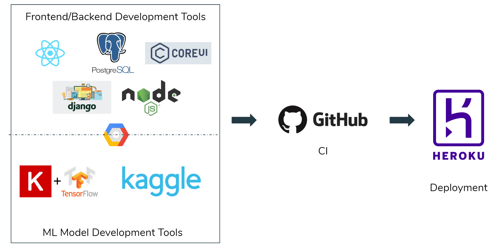
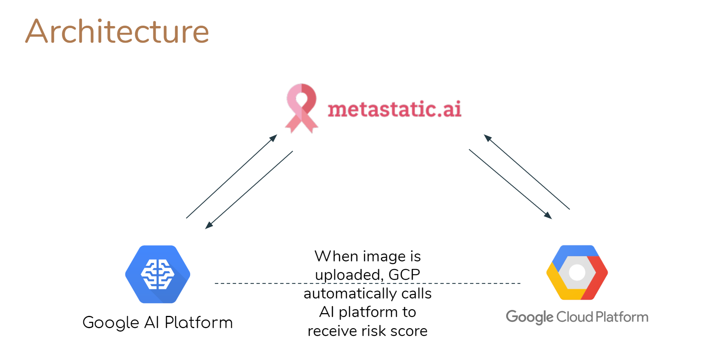
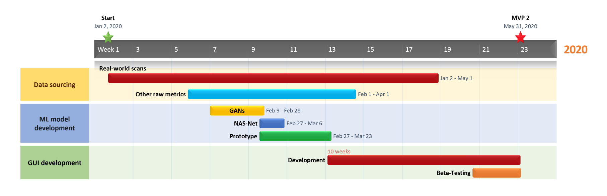

# Metastatic.ai

## Problem
Metastatic cancer is a type of cancer that can spread from part of the body to another. 
    *fatal disease where past the early stage prolonging survival is the only option

Estimated that 42,260 will die from breast cancer this year in the U.S.
    *90% of those deaths are caused by metastatic breast cancer. 
    *Only 25% of patients with metastatic breast cancer will survive in a 5-year period.[1]

Thus, our aim is:

    We are aiming to provide a platform to support doctors and oncologists effectively cure metastatic cancer at an early stage and prevent patients from reaching the later stages where prolonging survivability is the only option.

## Solution

Our solution is to develop a computer vision detection application that can analyze an input image of a metastatic tissue and output whether tissue is malignant or not. That way we will be able to save the precious time the oncologist/pathologist spends on studying the suspected tissue. They will be able to know whether a given tissue is malignant or not immediately, thereby allowing them to make further decisions on the treatments to be administered to get rid of the cancer at the early stage. 
The following diagram gives a high-level overview of the machine learning process:

## Technologies employed

### Architecture
 
 

### Setup script

Run the following development detup script:
    --script--

    

### Web app

 Visit our web app here: https://narwhals-ai.herokuapp.com/

## User Persona

### Doctors / Oncologists in Hospitals
    Target User

Doctors and Medical Oncologists from hospitals and cancer centers are our target customers. With metastatic cancer having a pretty low survival rate, the doctors will need more support in order to treat their patients thoroughly. With the use of our product, doctors could achieve significantly earlier detections of metastatic cancer. They would simply need to upload scan of the H&E stained image to our application and the output will be the risk score. That way, they can save time on studying the scans and immediately plan the treatment for their patients. By being able to embark on treatment early, there is a significantly higher chance of curing the patient. That way the doctor can ensure that the patient does not go through the further hardships with cancer and his/her longevity.
The doctor can also take H&E stained images in regular intervals and analyses them using our application to track the risk scores. Doctors will be able to understand the effect of their treatment on the cancer over time. To facilitate this tracking process, a record is maintained for each patient in the application.

### Metastatic Cancer patients
    Indirect User

The ultimate, though indirect, purpose of the app we will be building is to help patients detect the metastatic cancer they may have so as to start providing them treatment at an early stage.
The pathological report generated by the doctor using our application could help patients get some information regarding the cancer.
On the other hand, the doctor, who is the targeted user, can immediately embark on the right direction of treatment based on the result output by our model. The patient can receive early stage treatment and has a significantly higher chance of getting cured. 

## Build Plan

We have developed a complete Gantt chart which lays out the detailed schedule we will be following towards our second MVP on May 31 2020:

We hope to follow our timeline as close as possible and achieve the milestones mentioned.

## References
[1]Tarver, Talicia. “Cancer Facts &amp; Figures 2012. American Cancer Society (ACS).” Journal of Consumer Health On the Internet, vol. 16, no. 3, 2012, pp. 366–367., doi:10.1080/15398285.2012.701177.

[2] "Metastatic tissue scans", B. S. Veeling, J. Linmans, J. Winkens, T. Cohen, M. Welling. "Rotation Equivariant CNNs for Digital Pathology". arXiv:1806.03962 

[3]  "Sample-Surgical Pathology Report, UHN" https://www.researchgate.net/profile/Sylvia_Asa/publication/319357366/figure/fig2/AS:613886776573952@1523373421045/The-consolidated-theranostic-report-surgical-pathology-An-example-deidentified-to.png

