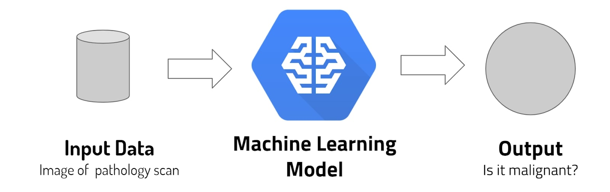
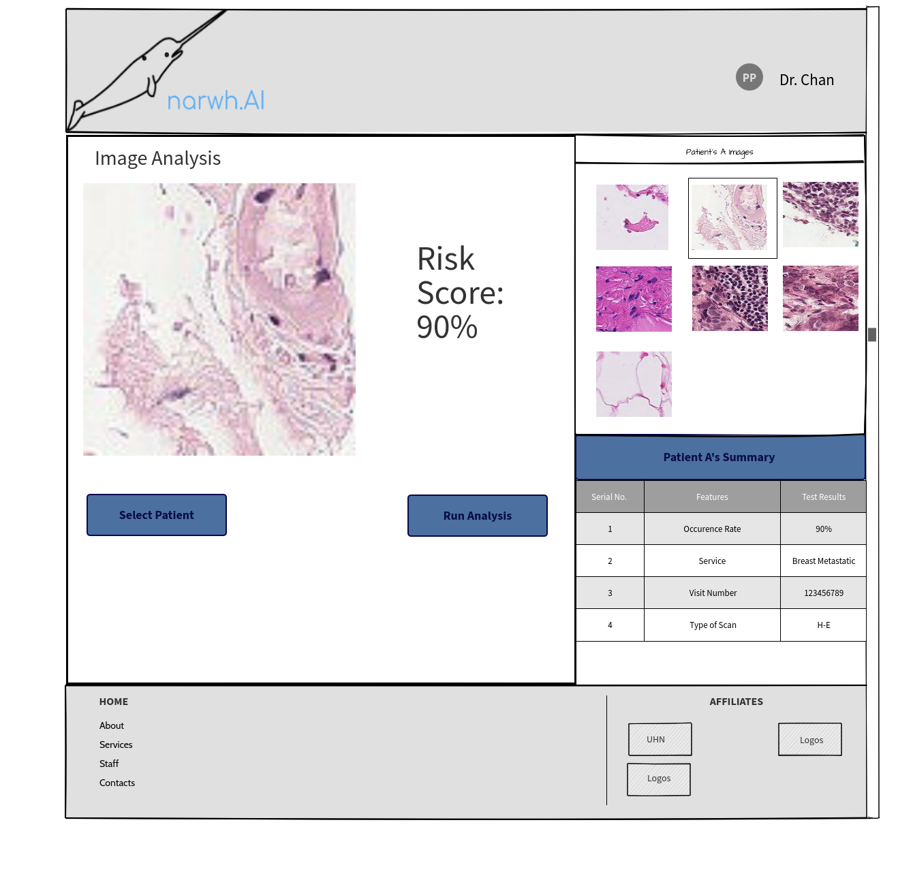
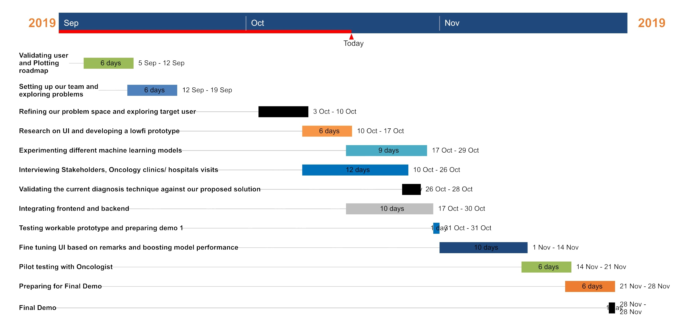

# User Validation and Roadmap

## Problem
Surviving cancer once is as lucky as it gets. However, a vast majority of cancer patients have to go through the vicious experience again in the form of metastatic cancer.

Metastatic cancer is a type of cancer that can spread from part of the body to another. It is a fatal disease where past the early stage prolonging survival and maintaining the quality of life are the only options of treatments for metastatic cancer patients.

It is estimated that 42,260 will die from breast cancer this year in the U.S. 90% of those deaths are caused by metastatic breast cancer. Only 25% of patients with metastatic breast cancer will survive in a 5-year period.

Thus, our problem is as follows (formulated in the form of an aim):

    We are aiming to provide a platform to support doctors and oncologists effectively cure metastatic cancer at an early stage and prevent patients from reaching the later stages where prolonging survivability is the only option.

## Solution

Our solution is to develop a computer vision detection application that can analyze an input image of a metastatic tissue and output whether tissue is malignant or not. That way we will be able to save the precious time the oncologist/pathologist spends on studying the suspected tissue. They will be able to know whether a given tissue is maligant or not immediately, thereby allowing them to make further decisions on the treatments to be admisistered to get rid of the cancer at the early stage. 
The following diagram gives a high-level overview of the machine learning process:

## Low Fidelity Mockups

The following 3 screenshots are our low fidelity <var></var>isualisations of our product. We showed this to the oncologist we interviewed. He was impressed by the simplicity of it. He mentioned that the functionalities visualised can be useful to pathologists. As of now, we are using hematoxylin and eosin stains for training the model such that it identfies metatstic tissue cells in them. He suggested that we try to generalise the model with other types of stained scans in the later stages of our product development. Also, he suggested that we talk to a pathologist to understand their specific needs they may require to ease the cancer detetction process even further.

### Dashboard Page
 
 

### Image Analysis Page

 

### Pathology Report Creation Page

 
 [1]  "SampleSurgical Pathology Report, UHN" https://www.researchgate.net/profile/Sylvia_Asa/publication/319357366/figure/fig2/AS:613886776573952@1523373421045/The-consolidated-theranostic-report-surgical-pathology-An-example-deidentified-to.png

## User Persona

### Doctors / Oncologists in Hospitals

Doctors and Medical Oncologists from hospitals and cancer centers are our target customers. With metastatic cancer having a pretty low survival rate, the doctors will need more support in order to treat their patients thoroughly. With the use of our product, doctors could achieve significantly earlier detections of metatstic cancer. They would simply need to upload scan of the H&E stained image to our application and the output will be the risk score. That way, they can save time on studying the scans and immediately plan the treatment for their patients. By being able to embark on treatment early, there is a significiantly higher chance of curing the patient. That way the doctor can ensure that the patient does not go through the further hardships with cancer and his/her longevity.
The doctor can also take H&E stained images in regular intervals and analyse them using our application to track the risk scores. Doctors will be able to understand the effect of their treatment on the cancer over time. To facilitiate this tracking process, a record is maintained for each patient in the application.

### Metastatic Cancer patients

The ultimate, though indirect, purpose of the app we will be building is to help patients detect the metatstic cancer they may have so as to start providing them treatment at an early stage.
The pathological report generated by the doctor using our application could help patients get some information regarding the cancer.
On the other hand, the doctor, who is the targetted user, can immediately embark on the right direction of treatment based on the result output by our model. The patient can receive early stage treatment and has a significiatly higher chance of geeting cured. 

## User Research

    We have been able to interview a radiation oncologist only. We are trying to arrange a meeting with a breast cancer oncologist.
    
We interviewed a radiation oncologist at the University Health Network. He is focused on using radiation treatment for gynecological cancer. Thus, he has aloe been incolved in studying tissue cells to identify cancer. Therefore, he was able to give us some solid advice with regards to our solutions and prototype. We presented our prototype to him and allowed him to navigate through the different features/pages. He was impressed by how straighforward our design was. He said that doctors require an abstracted layout just like we did, as some of them may not be tech-savvy to explore the app in detail. 

We had the following 2 tasks for him:
- Upload a scan and view risk score
- Navigate to report page then, edit if needed, if not submit it

He was able to do both tasks within a few seconds. He suggested that we talk to metatstatic cancer specialists as well to know the exact sections of the pathological report required. He also suggested that we have a sharing feature within the application so that certain images or reports an be shared with colleagues for further advice.

## Research Thoughts

Based on our first round of testing, the mockups have satisfied the oncologist we had tested it with. He can easily understand the design and is able to navigate through the app’s features without any help. 

We have received constructive feedback from the testers on making certain improvements. We have distilled the following points from our conversation with the oncologist:

- Stick to the simple design in our lowfi prototype
- Include specific sections required for the pathological report in the report creation feature by interviewing a pathologist
- Add a sharing feature to easily share files/reports with colleagues via the app

We hope to incorporate these changes gradually for our demo product. We will also be talking to more pathologists and oncologists and pilot testing the workable prototype with them to gain a lot more feedback.

## Build Plan

We have developed a complete Gantt chart which lays out the detailed schedule we will be following towards our final demo on November 28:

We hope to follow our timeline as close as possible and achieve the milestones mentioned.

