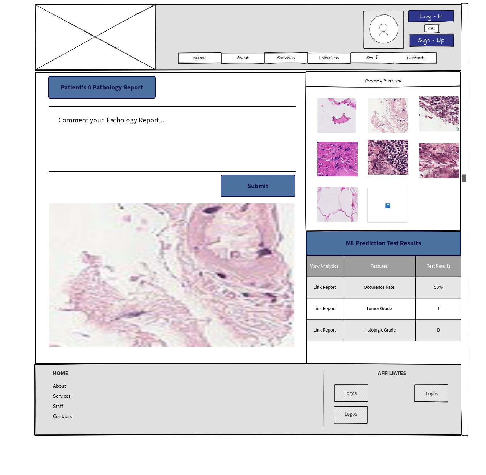
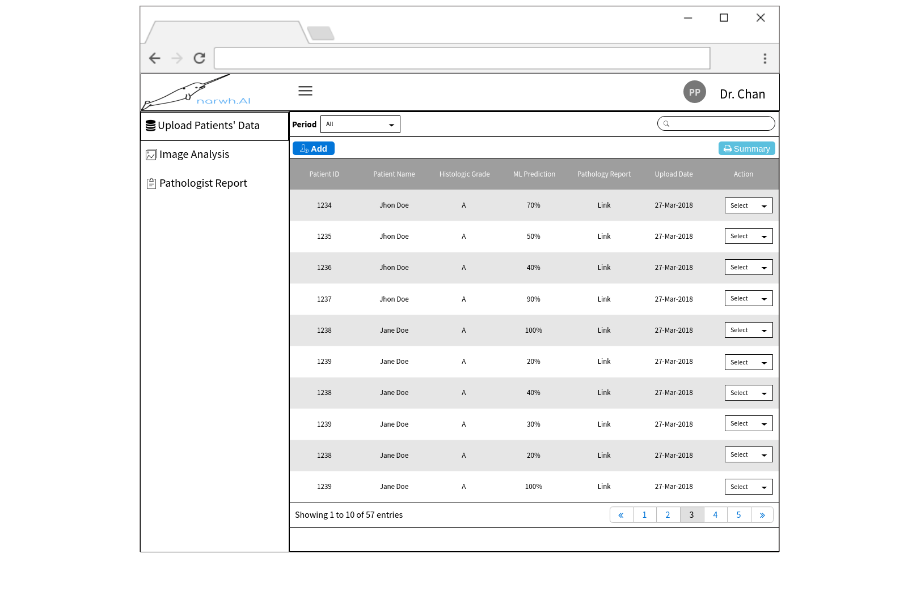
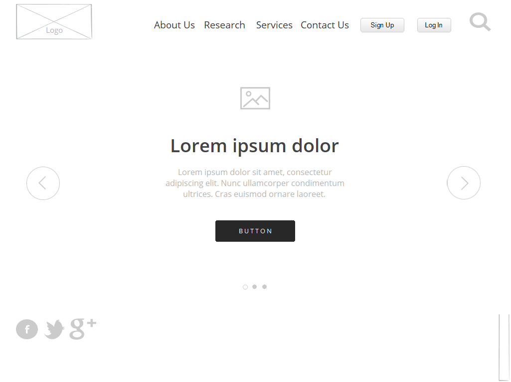

# Customer Research

## Problem
Hundreds of thousands of people are affected by metastatic cancer after they have been cured of their primary cancer. We want to help them by preventing them from going through the hardship and pain of cancer again.

## Solution
Our solution is to develop a computer vision detection application that can analyze an input image of a metastatic tissue and output whether tissue is malignant or not.

## Low Fidelity Mock ups

### Metastatic Cancer Analysis DashBoard

 

### Pathologist Patients' Data Dashboard
 
 

 ### Home Page

 

## User Persona

### Doctors / Medical Oncologist in Hospitals

- Doctors and Medical Oncologists from hospitals and cancer centers will be our target customers, as they are the main people who manage a cancer patient’s care throughout the course of disease. 

- Our proposed solution will provide a platform to improve doctors’ clinical decisions and identify the best treatments for patients with metastatic cancer at an early stage. 

### Cancer Patients

- Currently, there is no existing healthcare software which provides statistical analysis to illustrate the cancer diagnosis to patients.

- Our proposed solution will provide a platform for doctors to share detail analytical reports for cancer patients to determine what are the best treatments for them.

## User Research

## Research Thoughts 

