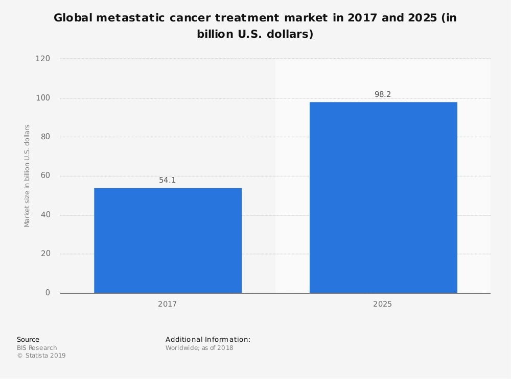

# Market

## Market Landscape

Our vision is to create a computer vision application that detects metastatic cells in pathology scans at an early stage. This prevents the patients from having to go through the pain of later stages of cancer when prolonging survivability is the only option. Thus, the market we are targetting is the global metastatic cancer treatment market which values at USD 54 billion in 2017 and is expected to attain an 80%growth to USD 98 billion in 2025.

 

The metastatic cancer treatment market can be further segmented into the different types of cancer as follows:

 

As seen in the graphic above, metastatic breast cancer forms a third of the treatment market. We managed to find the PatchCamelyon dataset which contains images extracted from histopathologic scans of lymph node sections. The images may have metastatic breast cancer cells. Therefore, we will be able to create a minimum viable product that detects the presence of metastatic breast cancer. Thus, with the MVP itself, we would have tackled a third of the metastatic cancer market.
As a further testament to the immense potential this market holds, we would like to present an estimated revenue from administering these early-stage cancer detections.

-------------------------------------------
 Each year, there are 150000 people who suffer from metastatic breast cancer in the USA. 
We estimate that a detection process will cost about USD200 based on the current prices charged by Sophia Genetics, a Swiss healthcare data analytics startup, for their computer vision-based genetic evaluation.
-------------------------------------------
Therefore, the estimated revenue per year is USD30 million from metastatic breast cancer patients in the United States. This shows that we are indeed targetting a vibrant market with huge potential. In addition to that, we will also be saving hundreds of thousands of lives and preventing them from having to suffer hardship by being able to administer treatments to them at an early stage.

## Market Opportunity

### Problem: Metastatic Cancer 

Surviving cancer once is as luck as it gets. However, a vast majority of cancer patients have go through the vicious experience again in the form of metastatic cancer. 

Metastatic cancer is a type of cancer that can spread from part of the body to another. It is a fatal disease that prolonging survival and maintaining the quality of life are the only options of treatments for metastatic cancer patients. 

It is estimated that 42,260 will die from breast cancer this year in the U.S. 90% of those deaths are caused by metastatic breast cancer. Only 25% of patients with metastatic breast cancer will survive in a 5-year period.

We are aiming to provide a platform to support doctors and oncologists effectively cure metastatic cancer at an early stage and prevent patients from reaching the stage where prolonging survivability is the only option. 

### Business Idea

We are going to create computer vision application that can be used to identify whether a digital pathology scan contains a malignant metastatic tissue or not. 

This application will be targeted for use by cancer professionals at hospitals and cancer research institutes. 

The revenue model will be a monthly subscription plan for accessing the web-based application. Staff can access the web-based application via credentials specific to their medical institution.

### Why is the Opportunity Cost to implement it now ?

By making use of computer vision to identify metastatic cancer in small image patches from larger digital pathology scans, doctors will be able to identify the best treatment for patients with metastatic cancer at an early stage. Thus, it will significantly reduce the risk of patients reaching the stage where they only have a finite number of time left to spend with his/her love ones. If we don't implement the application now, there will be more family devastations caused by deaths from metastatic cancers each year. 

The global metastatic cancer treatment market is estimated to be worth USD$54.1 BN in 2017 and it is expected to grow by 80% to almost USD$100 BN by 2025. There is tremendous potential in the market for our product. If we do not crack into the market now, we will lose the potential to expand by attracting VC funding from AI Healthcare and Oncology. We might also lose the opportunity to become the leading company within the market, as  there are no company currently tackling the early detection of metastatic cancer.  

## Market Analysis 

### Overview

To give an overview of the market, the global cancer study and research is valued at USD 11.0 billion in 2018 and is estimated to expand at a CAGR of around 13.7% over the forecast period. 

In addition, the market for AI used for Medical Imaging will reach $2 billion by 2023.

Estimated Calculation:

More than 154,000 women suffering from metastatic cancer in 2018.

That means that a total of 154000 x 200 = 30,800,000 could be spent on early detection of metastatic cancer among just breast cancer patients in the US. 

### Competition

Currently, the hot startups in the space of early cancer detection are focusing on a medical approach such as developing new blood tests to detect cancer at an early stage. 

They're a very small number of players who employ the use of AI in detecting cancer at an early stage. Based on our research, there are no companies currently tackling the early detection of metastatic cancer. 

We could be the first to crack into this market. This will allow us to capture a major share of the market. 

#### Major Players

Novartis has invested in various acquisitions and partnerships over the past year, notably a clinical collaboration with Bristol-Myers Squibb to evaluate potential treatments in metastatic colorectal cancer.

In addition, Tencent has partnered up with Merck’s Biopharma Business to develop an Artificial Intelligence platform to shorten the process of medical treatment metastatic colorectal cancer.

There are many types of metastatic cancers still yet to be tackled such as Kidney, Lung, and Stomach etc. We believe that with the vast amount of data available and our passion to apply AI for early cancer detection, we will be able to develop deep learning applications to detect cancer early.

## Our Team Expertise

Our team has a strong technical background and rich experience in encountering and solving immense problems.

Every member in our team has some experience in developing Machine Learning application in Python, which will enable the team to examine the project from multiple viewpoints effectively and analyzing technical issues and information efficiently. We believe that we have the expertise to build a suitable Machine Learning Model which will make a major contribution to diagnosing this cancer through the use of deep learning. 

On the other hand, our team is lacking an oncology specialist who can provide insights on the current solution to diagnose cancer and to help us creating a model to truly represent the characteristics of metastatic cancer. 

