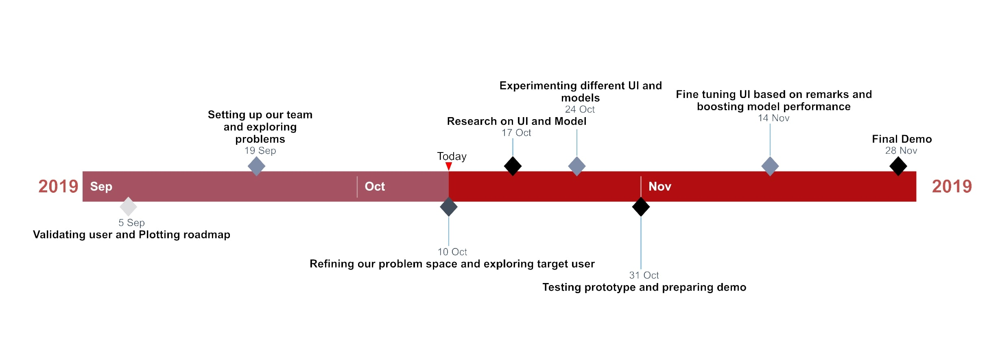

# Roadmap

##Overview
As of now, we have the complete dataset for training and testing the computer vision models we will be building. We can divide the technical development of our application into 2 parts: 
Frontend: Web application that medical professionals in hospitals use
Backend: The computer vision model that classifies the pathology scans uploaded to the application
We have planned to build both components separately, then integrate them at a later stage. To develop both components, we have to do some research to make the product as suitable as possible to the target problem and users.

## Research
For the frontend development, we will be talking to cancer professionals who can provide valuable information they facing with current prediction systems and features they require in the application to make diagnosis and reporting easier.
On the other hand, backend development will require us to talk to healthcare data scientists who have had experience working on healthcare computer vision projects.

## Plans
We will be starting by building a simple user interface and a baseline model for our application. We want to show that medical professionals can use such a system for metastatic cancer detection with at least 90% accuracy for our primary prototype. This will act as a proof of concept as well. We will launch the primary prototype on October 31. Our detailed plans are explained in the long/short term section below and Gantt chart.

## UI/UX decisions 

## The Machine Learning Pipeline

We will be trying a baseline model first to prove our concept of early cancer detection via computer vision. 
A simple overview of the complete pipeline is given below:

We have summarised some of the considerations we will be making for building our model:
1. Data Augmentation: the images will be augmented to introduce variations in the dataset. Examples of possible augmentations include: random cropping and horizontal/vertical flipping
2. Using a baseline model to get some basic results such as Resnet50 ImageNet model
3. Using regularization techniques to avoid overfitting: DropOut, Noise and Early Stopping

Our future plans are given below:

## Short Term

**Duration:** October 31 2019

We intend to demonstrate a simple UI and the primary machine learning model in our first prototype. It will include all our intended functionalities. Based on the remarks we get during the demo, we will improve our product

## Medium Term

**Duration:** January 2020

We intend to demonstrate our barebones alpha version in the medium term. It will include new features  created based on the remarks from the prototype demo. This mid term product will include a highly optimised model and the complete user interface very close to what could be seen in the final product.

## Long Term

**Duration:** May 2020

We intend to launch the product officialy. AT this stage, we would have optimised our product to be able to detetc the different type of metastatic cancer. We would launch the product with Toronto hospitals to get first-hand reviews of our products performance before we make a wider launch across Ontario, Canada and eventually, the world.

We also present a Gantt chart below to formalize our intended schedule for the MVP development:
