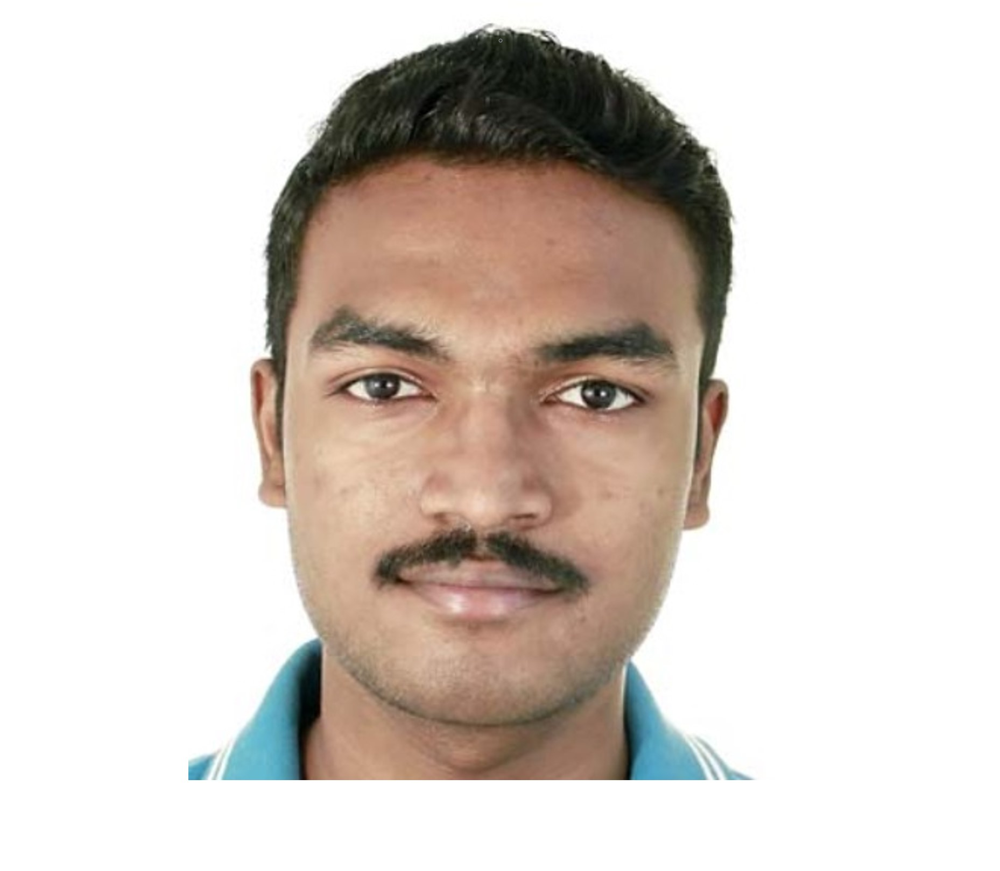

# Arun Raja

- Software Developer
- arun.raja@mail.utoronto.ca

## Links

- [GitHub](https://github.com/deeplearner2019)
- [LinkedIn](https://www.linkedin.com/in/arun-raja-569502148/)
- [Twitter](#)
- [Website](#)
- [Resume](#)

## About Jane

Arun Raja is an AI and Computer Science undergraduate student from The University of Edinburgh. He is passionate about applying deep learning to healthacare applications. He loves to watch football and he is a fan of Bayern Munich.

## Strengths

- Straightforward
- Problem Solver
- Patient

## Weaknesses

- Presentation skills
- Time management
- Getting too absorbed into the details
